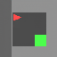

# Mini-Genie: Latent Action World Models 🧞‍♂️

A generative World Model that learns to play and simulate **MiniGrid** environments from pixels, without access to ground-truth actions.

This project implements a **VQ-VAE** to compress visual observations into discrete tokens and a **Transformer Dynamics Model** to discover latent actions and predict future states (dreams) using **Entropy Regularization**.

---

## 🧠 Architecture

1. **The Eyes (VQ-VAE)**  
   Compresses 64×64 game frames into a 16×16 grid of discrete tokens.

2. **The Brain (Transformer)**  
   Learns the physics of the world. It infers *latent actions* (e.g., Left, Right, Forward) purely by observing state transitions, clustering them via entropy regularization.

3. **The Dream (Generative Loop)**  
   Autoregressively hallucinates consistent future trajectories by feeding predictions back into the model.

---

## 📊 Results

### 1. Latent Action Discovery (t-SNE)
The model successfully separates agent behaviors into distinct action clusters in a fully unsupervised way.


### 2. Dreaming the Future
An example of the agent “dreaming” a trajectory by predicting 50 future frames from a single initial observation.



---

## 🚀 How to Run

### 1. Installation

```bash
conda create -n mini-genie python=3.10
conda activate mini-genie
pip install -r requirements.txt
pip install gym-minigrid
```

---

### 2. Data Collection

Record 1,000 active episodes where the agent explores the environment:

```bash
python src/record_active_data.py
```

---

### 3. Training Pipeline (End-to-End)

This script tokenizes the data, trains the Transformer dynamics model, and generates visualizations:

```bash
sbatch scripts/fix_and_train.sh
```

(Optional) Retrain the VQ-VAE (vision module) if generated dreams appear blurry or gray:

```bash
sbatch scripts/retrain_vision.sh
```

---

## 📂 Project Structure

```text
mini-genie/
├── data/                  # Datasets and Artifacts
│   ├── episodes/          # Raw .npz game recordings (1000 files)
│   ├── tokens/            # Tokenized episodes (VQ-VAE output)
│   └── artifacts/         # Saved models (.pth), plots, and GIFs
├── src/
│   ├── record_active_data.py       # 1. Generates raw game data (MiniGrid)
│   ├── train_vqvae.py              # 2. Trains the "Eyes" (Visual Compressor)
│   ├── tokenize_data.py            # 3. Converts images to discrete tokens
│   ├── train_transformer_dynamics.py # 4. Trains the "Brain" (World Model)
│   ├── visualize_tsne.py           # 5. Analysis: Plots the Brain's latent concepts
│   └── generate_dream_gif.py       # 6. Visualization: Generates the dream video
└── scripts/               
    ├── fix_and_train.sh            # Main pipeline (Tokenize -> Train -> Viz)
    └── retrain_vision.sh           # Optional: Retrain VQ-VAE only
```

---

## 🏁 Final Steps

1. **Delete** unnecessary intermediate files to clean the workspace.
2. **Edit `src/record_active_data.py`**: set `TOTAL_EPISODES = 1000`.
3. **Edit `src/train_transformer_dynamics.py`**: set `EPOCHS = 30`.
4. **Run** data collection:
   ```bash
   python src/record_active_data.py
   ```
   (≈10–20 minutes)
5. **Run** training:
   ```bash
   sbatch scripts/fix_and_train.sh
   ```
   (≈3 hours)

Go get that 1000-episode model — this will be the definitive version. 🚀