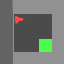

# 🧞‍♂️ Mini-Genie: Unsupervised World Models from Video

**Mini-Genie** is a PyTorch implementation of the **Genie (Generative Interactive Environments)** architecture. It solves a fundamental challenge in AI: *learning a playable world model purely from unlabelled video data.*

Without any action labels or physics engines, Mini-Genie learns to:
1.  **See**: Compressing video into discrete tokens.
2.  **Act**: Inferring latent actions (what changed between frames?).
3.  **Dream**: Predicting future states in an interactive loop.

---

## 🔮 Results: Dream vs. Reality

The core capability of Mini-Genie is "dreaming" plausible futures. Below is a comparison between a **hallucinated trajectory** (left) generated entirely by the model, and a **real episode** (right) from the dataset.

<div align="center">
  <table>
    <tr>
      <td align="center"><strong>🤖 Generated Dream (World Model)</strong></td>
      <td align="center"><strong>📺 Real Episode (Ground Truth)</strong></td>
    </tr>
    <tr>
      <td></td>
      <td></td>
    </tr>
  </table>
  <p><em>Note how the World Model maintains spatial coherence and physics-like transitions similar to the real game.</em></p>
</div>

### 🧠 Latent Action Space
How does the model control this world? By discovering **Latent Actions**. The t-SNE plot below shows how the model unsupervisedly clusters frame transitions into distinct "moves" (e.g., jump, move right, stay).

<div align="center">
  
</div>

---

## 🏗️ Architecture

Mini-Genie implements the three-stage pipeline defined in the Genie paper:

### 1. Spatiotemporal Tokenizer (VQ-VAE)
*   **Goal**: Compress high-dimensional video ($T \times H \times W$) into compact discrete tokens ($T \times h \times w$).
*   **Tech**: Custom VQ-VAE with 512 codebook entries.
*   **Result**: Reduces dimensionality while preserving semantic visual information.

### 2. Latent Action Model (LAM)
*   **Goal**: Learn *what* happened between two frames $x_t$ and $x_{t+1}$ without labels.
*   **Tech**: VQ-VAE style encoder that discretizes frame differences into $K$ finite action codes.
*   **Optimization**: Uses Entropy Regularization to prevent "mode collapse" (ensuring the model uses all available actions).

### 3. Dynamics Model (The "Brain")
*   **Goal**: Predict the next token frame $z_{t+1}$ given history and the latent action $a_t$.
*   **Tech**: A **CNN-Based Residual Forecaster**. Unlike the original paper's Transformer, we utilize a convolutional architecture to strictly enforce spatial coherence on smaller datasets, preventing "pixel soup" hallucinations.

---

## 🚀 Quick Start

### Installation
```bash
git clone https://github.com/yourusername/mini-genie.git
cd mini-genie
pip install -r requirements.txt
```

### Automatic Pipeline
Run the full training and generation suite with a single command:
```bash
bash scripts/fix_and_train.sh
```

### Project Structure
*   **`src/train_vqvae.py`**: Trains the visual compressor.
*   **`src/train_transformer_dynamics.py`**: Trains the LAM and World Model jointly.
*   **`src/generate_dream_gif.py`**: autoregressively "dreams" a video starting from a seed frame.

---

## ⚙️ Configuration
The model is tuned for stability on standard GPUs (tested on A100/V100):
*   **Learning Rate**: 1e-4 (AdamW)
*   **Input Window**: 4 frames
*   **Action Space**: 8 latent codes

*Based on the research paper "Genie: Generative Interactive Environments" (DeepMind, 2024).*